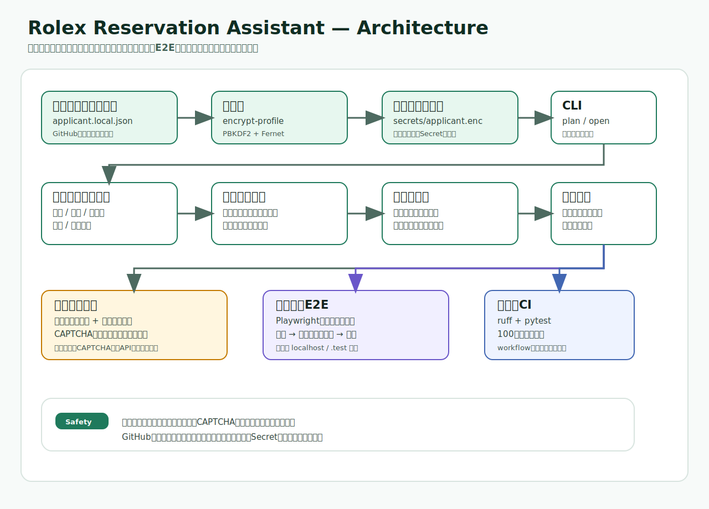

# Rolex Reservation Assistant



Rolex boutique reservation pagesの応募準備を支援する、安全第一のPython CLIです。応募文生成、暗号化プロフィール読み込み、ランダムな直近日付・午後枠の選択、入力計画、予約ページ起動、締切確認、CAPTCHA費用見積もり、監査ログ、ローカルE2Eフォーム入力デモ、100回リハーサル検証を1つのリポジトリにまとめています。

このリポジトリには個人情報を載せません。応募者の氏名、メール、電話番号、生年月日などは、ローカルで暗号化したファイル、またはGitHub Actions Secrets / Codespaces Secretsから読み込む設計です。

このツールは、実サイトに対する無人応募送信、CAPTCHA突破、アクセス制御回避、外部CAPTCHA解決APIへの実連携を実装しません。実サイトでは、CAPTCHA解決と最終送信は必ず人間が画面を確認して行う前提です。一方で、E2Eテスト用のローカル予約フォームでは「応募文生成 → 全項目入力 → 送信 → 送信後確認」まで安全に動作確認できます。

## 対象予約ページ

| key | 店舗 | URL |
| --- | --- | --- |
| `osaka-umeda` | 大阪 | https://reservation.rolexboutique-hiltonplaza-osaka.jp/osaka-umeda/reservation |
| `ginza` | 銀座 | https://reservation.rolexboutique-lexia.jp/ginza/reservation |
| `omotesando` | 表参道 | https://reservation.rolexboutique-omotesando-tokyo.jp/omotesando/reservation?func_distinction=1 |
| `shinjuku` | 新宿 | https://reservation.rolexboutique-lexia.jp/shinjuku/reservation |
| `nagoya-sakae` | 名古屋栄 | https://reservation.rolexboutique-lexia.jp/nagoya-sakae/reservation |

## できること

- 予約ページを1店舗または全店舗で順番に開く
- 暗号化プロフィールから応募者情報を復号して入力計画を作る
- 氏名、メール、電話番号、生年月日、希望店舗、希望日、備考を入力計画に含める
- 希望日が `auto` の場合、今日から近い日付をランダム選択する
- 希望時間が `afternoon` の場合、午後枠からランダム選択する
- 希望モデル候補からランダムに1つ選び、応募文に入れる
- CAPTCHA処理の費用見積もりを計算する
- ローカルE2Eデモでフォーム全項目入力と送信を検証する
- 入力停止に備えたローカルE2E用のフォールバックセレクタを生成する
- `rehearse --iterations 100` で100回以上の計画生成・検証を行う
- 実サイトでは手動CAPTCHA・手動送信のチェックリストを表示する
- 監査ログをJSON Linesで保存する
- Codespaces / devcontainerで即起動する

## 実装しないこと

- CAPTCHAを解く、回避する、第三者サービスへ送って突破する
- 実予約サイトの最終応募ボタンを無人クリックする
- 公開予約サイトに対する自動入力、連続アクセス、大量応募
- 認証・レート制限・bot対策の回避

## クイックスタート

```bash
python -m venv .venv
. .venv/bin/activate  # Windows: .venv\\Scripts\\activate
pip install -e .[dev]
python -m rolex_reservation_assistant --help
```

サンプルプロフィールをコピーします。このファイルは `.gitignore` で除外される `config/applicant.local.json` として作ってください。

```bash
cp config/applicant.example.json config/applicant.local.json
```

`config/applicant.local.json` に実データを入れたら、暗号化します。

```bash
export APPLICANT_PROFILE_PASSPHRASE="change-this-long-random-passphrase"
python -m rolex_reservation_assistant encrypt-profile \
  --in config/applicant.local.json \
  --out secrets/applicant.enc \
  --passphrase-env APPLICANT_PROFILE_PASSPHRASE
```

暗号化プロフィールから応募文と入力計画を表示します。

```bash
python -m rolex_reservation_assistant plan \
  --encrypted-profile secrets/applicant.enc \
  --passphrase-env APPLICANT_PROFILE_PASSPHRASE \
  --location ginza
```

予約ページを開き、手動入力・手動CAPTCHA・手動送信で進めます。`--interval-seconds` は全店舗を開くときの間隔です。

```bash
python -m rolex_reservation_assistant open \
  --encrypted-profile secrets/applicant.enc \
  --passphrase-env APPLICANT_PROFILE_PASSPHRASE \
  --location all \
  --interval-seconds 20
```

締切までの残り時間を含めて表示する場合:

```bash
python -m rolex_reservation_assistant plan \
  --encrypted-profile secrets/applicant.enc \
  --passphrase-env APPLICANT_PROFILE_PASSPHRASE \
  --location all \
  --deadline "2026-06-22T23:59:00+09:00" \
  --audit-log outputs/audit.jsonl
```

CAPTCHA費用見積もりだけを確認する場合:

```bash
python -m rolex_reservation_assistant captcha-cost --expected-count 5 --cost-per-1000 2.99
```

## ランダム日付・午後枠・モデル名

`preferred_date` が `auto` の場合、Asia/Tokyo基準で今日から1〜10日後の日付をランダム選択します。`preferred_time_window` が `afternoon` の場合、`13:00-15:00`、`15:00-17:00`、`17:00-19:00` から選びます。

希望モデルは `preferred_models` の配列から選ばれます。`レイトナー` のような表記も候補として入れられます。標準候補には「コスモグラフ デイトナ」「サブマリーナー」「GMTマスターⅡ」「エクスプローラー」「デイトジャスト」「ランドドゥエラー」を含めています。

## ローカルE2Eフォーム入力デモ

E2Eでは、実予約サイトではなくローカルのモック予約フォームを対象にします。これにより「応募文生成 → 全項目入力 → 送信 → 送信後確認」まで安全にテストできます。

```bash
python scripts/run_mock_site.py --port 8765
```

別ターミナルで、入力計画からPlaywright用スクリプトを生成します。

```bash
python -m rolex_reservation_assistant e2e-script \
  --encrypted-profile secrets/applicant.enc \
  --passphrase-env APPLICANT_PROFILE_PASSPHRASE \
  --location ginza \
  --url http://127.0.0.1:8765 \
  --selectors config/selectors.mock.json \
  --out outputs/e2e_fill_mock.py \
  --submit
```

Playwrightを入れて実行すれば、ローカルフォームへの入力と送信を確認できます。

```bash
pip install playwright
python -m playwright install chromium
python outputs/e2e_fill_mock.py
```

`outputs/mock_submissions.jsonl` に送信結果が保存されます。

100回以上のリハーサル検証を行う場合:

```bash
python -m rolex_reservation_assistant rehearse \
  --profile config/applicant.example.json \
  --location all \
  --selectors config/selectors.mock.json \
  --iterations 100
```

## CAPTCHAプロバイダ枠組み

`src/rolex_reservation_assistant/captcha.py` に以下の枠組みがあります。

- `manual`: 人間が画面上でCAPTCHAを解く前提
- `enterprise-placeholder`: 社内承認済みワークフローへ差し替えるためのプレースホルダ

`enterprise-placeholder` は実APIを呼びません。実サイトのCAPTCHAを第三者サービスで突破する処理は、このリポジトリでは対象外です。

## GitHub Secrets / Codespaces Secrets

実値はGitHubにコミットしません。必要に応じて以下のSecret名を使います。

- `APPLICANT_PROFILE_PASSPHRASE`: 暗号化プロフィール復号用パスフレーズ
- `APPLICANT_PROFILE_B64`: 暗号化プロフィールファイルをbase64化してCI等へ渡す場合の値
- `RESERVATION_AUDIT_LOG_BUCKET`: 監査ログ保管先
- `ENTERPRISE_CAPTCHA_PROVIDER_URL`: 社内承認済み人間確認ワークフローのURL
- `ENTERPRISE_CAPTCHA_PROVIDER_TOKEN`: 上記ワークフローの認証トークン

## アーキテクチャ概要

README冒頭と `docs/architecture.md` にSVG画像版のアーキテクチャ図を埋め込んでいます。GPT image用プロンプトは [`docs/gpt-image-architecture-prompt.md`](docs/gpt-image-architecture-prompt.md) にあります。

詳細は [`docs/architecture.md`](docs/architecture.md) を参照してください。

## CI/CD

GitHub Actions workflowの本来の配置先は `.github/workflows/ci.yml` です。現在のGitHub連携トークンではworkflow作成がGitHub API 404で拒否されたため、同一内容を `docs/ci/python-ci.yml` に保存しています。

workflow内容:

- checkout
- Python 3.11 / 3.12 setup
- dependency install
- ruff lint
- pytest
- JUnit artifact upload

## 本番で必要なもの

実サイトで運用する場合でも、このツールが担当するのは応募準備、ページ起動、入力計画、手動チェックリストまでです。

- Python 3.11以上
- 暗号化された応募者プロフィール
- `APPLICANT_PROFILE_PASSPHRASE`
- 人間によるCAPTCHA確認と最終送信
- 必要に応じた社内承認済み監査ログ保管先
- 外部サービスを使う場合は、サイト規約、法務、セキュリティ、個人情報保護の承認

## テスト

```bash
ruff check .
pytest
```
