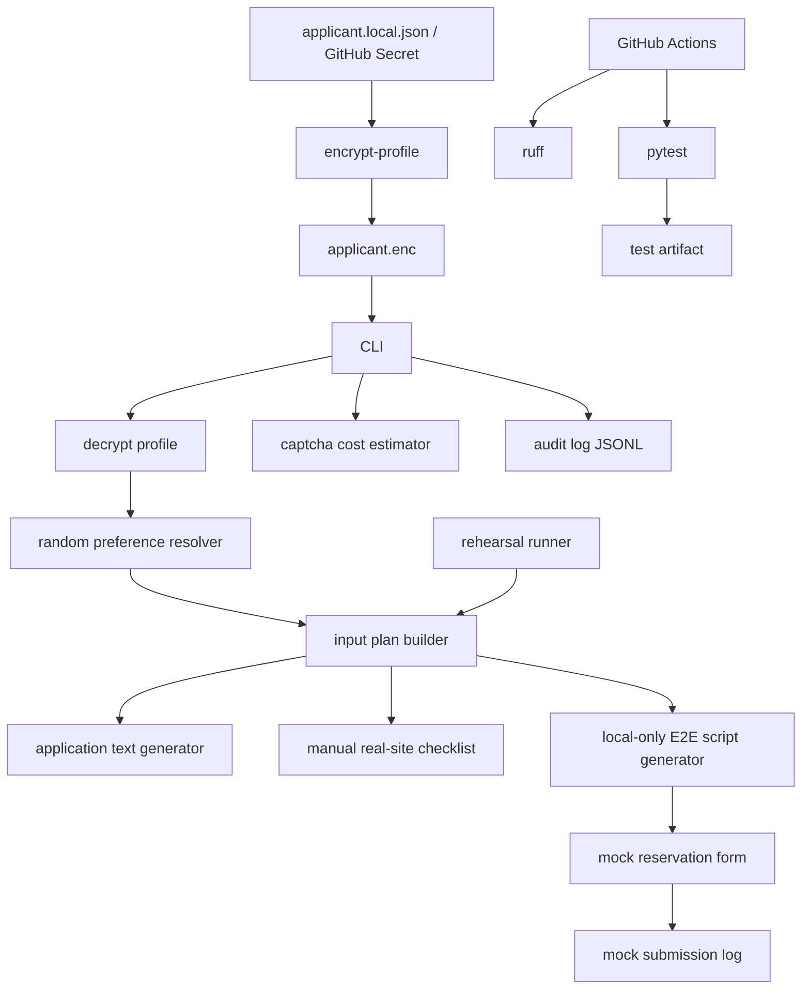

# Architecture

## 全体像

このツールは、予約応募の準備作業をCLIで整理し、実サイトでは人間の確認を必ず残す構成です。個人情報はGitHubに置かず、ローカルで暗号化したプロフィールまたはSecretsから読み込みます。

## 処理の流れ

1. `config/applicant.local.json` をローカルに作成する。
2. `encrypt-profile` で `secrets/applicant.enc` に暗号化する。
3. `plan` で応募文、希望日、午後時間帯、希望モデル、入力チェックリストを生成する。
4. `open` で予約ページを1店舗ずつ開く。複数店舗では既定で20秒間隔を置く。
5. 実サイトでは人間がCAPTCHAと最終送信を確認する。
6. `e2e-script` はlocalhostなどのローカルE2E対象だけにPlaywrightスクリプトを生成する。
7. `rehearse --iterations 100` でランダム選択、必須項目、送信スクリプト、フォールバック、公開URLブロックを検証する。

## フォールバック設計

ローカルE2E用のPlaywrightスクリプトは、各フィールドに複数のセレクタ候補を持ちます。最初の候補が見つからない場合、次の候補を順に試します。入力後は `input_value()` で値を検証し、値が一致しない場合は `fill()` で再入力します。送信後は成功マーカーを確認します。

## セキュリティ

- 個人情報の平文ファイルは `.gitignore` で除外しています。
- 暗号化プロフィールは `cryptography.Fernet` とPBKDF2-SHA256で保護します。
- Secretsの実値はREADMEにもコードにも含めません。
- CAPTCHA突破APIの実装は入れていません。
- 公開予約サイトをE2E自動化対象にすると例外を出します。

## CI/CD

GitHub Actionsは以下を実行します。

- checkout
- Python 3.11 / 3.12 setup
- dependency install
- ruff lint
- pytest
- JUnit artifact upload

## GPT image 最新モデル用の図解方針

`docs/gpt-image-architecture-prompt.md` のプロンプトをGPT imageの最新モデルに入力すると、初心者向けのアーキテクチャ図を生成できます。画像はリポジトリに固定せず、最新モデルで再生成可能な資料として管理します。
